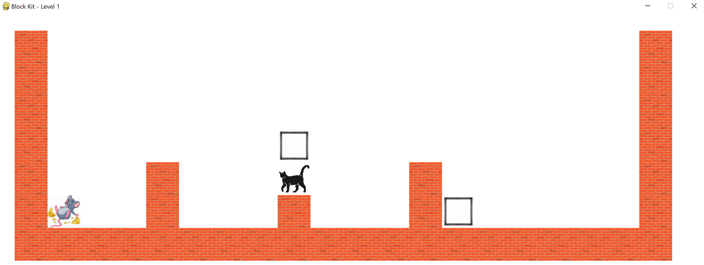

# Block-Kit
***Mouse Hunt Puzzle Game!***

Puzzle game based upon the TI-84 calculator game "block dude". Modernized the UI using the PyGame engine.

Developed for hobby purposes only. Not claiming intellectual rights. 

## Launch Game Command
`> python BlockKit.py`

## Controls
**Left/Right Arrows**: Movement

**Up Arrow**: Climb

**Space**: Pickup/Place a Block

**Esc**: Restart Level

## Goal
Arrange the blocks by any means to reach dinner! 🐭

